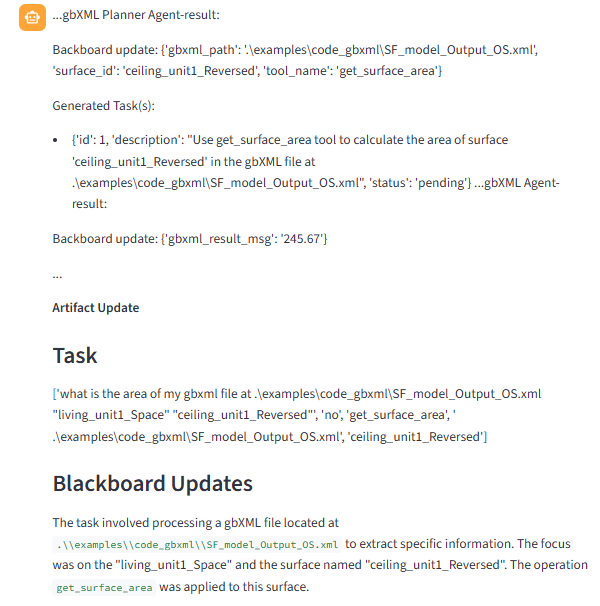

# gbXML Agentic Network Example

This example demonstrates a multi-agent workflow for querying gbXML building geometry and construction data using MCP tools. It mirrors the COMcheck agentic pattern while focusing on gbXML files and exposes both an agent-cards A2A server and an SSE-based gbXML MCP server.

## Project context
- Part of the first phase of the BIM extraction work associated with the preprint paper: https://arxiv.org/abs/2510.02634
- A COMcheck-oriented agent can be built with the same orchestration logic, but that implementation is not open at this time.

## Repository layout
```
examples/
  gbxml/
    gbxml_app.py          # Agent network entrypoint
    agent_cards/          # Planner, gbXML agent, and summary agent cards (JSON)
    app_mcps/
      model_mcp.py        # FastMCP server exposing gbXML analysis tools
    gbxml_file/
      SF_model_Output_OS.xml (sample gbXML)
```

## Requirements
Install dependencies alongside `automa-ai`:
- automa-ai >= 0.2.10
- lxml >= 6.0.2
- xgbxml >= 0.0.10
- triangle
- matplotlib

Use `uv` or `pip` to add them; for example:
```bash
uv pip install "automa-ai>=0.2.1" "lxml>=6.0.2" "xgbxml>=0.0.10" triangle matplotlib
```

## Running the gbXML agent network
1. Ensure the sample gbXML file is available at `examples/gbxml/gbxml_file/SF_model_Output_OS.xml` or provide your own path when prompted.
2. Start the example from the project root:
```bash
uv run python -m examples.gbxml.gbxml_app
```
3. Enter a request such as:
```
List all surfaces in examples/gbxml/gbxml_file/SF_model_Output_OS.xml
```

## What the scripts do
- `gbxml_app.py` launches three agents (planner, gbXML tool caller, and summary) on the agent-cards A2A server and boots a dedicated gbXML MCP server over SSE.
- `app_mcps/model_mcp.py` registers gbXML tooling (surface listing, area, tilt, insulation, and construction lookup) with FastMCP, including a simple CLI for direct use.

## Direct MCP usage
You can run the MCP server or call its tools directly for debugging:
```bash
# Start the MCP server (SSE)
uv run python -m examples.gbxml.app_mcps.model_mcp serve --host 127.0.0.1 --port 10160 --transport sse

# List surfaces from the sample file
uv run python -m examples.gbxml.app_mcps.model_mcp ls --gbxml-path examples/gbxml/gbxml_file/SF_model_Output_OS.xml
```

## Notes
- The agentic network expects the agent-cards server to be reachable at `http://localhost:10100` and will start the gbXML MCP server on `http://127.0.0.1:10160` (SSE transport).
- Planner instructions enforce minimal gbXML inputs (file path and surface IDs for surface-specific tools) and always include a task to run a simulation on the original model.
- Tool outputs may be written to `examples/gbxml/app_mcps/requests/` when `save_response_as` is provided.

## Additional Notes

1. **Environment configuration**
   - Refer to `example.env` as a template.
   - Create your own `.env` file and set the required values, including the **model name** and **model URL**.
   - Ensure the specified model is available and accessible, whether running **locally** or on a **remote service**.
   - Ensure updated model name and url in "gbxml_app.py"

2. **Example output**
   - An example output of the system is shown below.

   