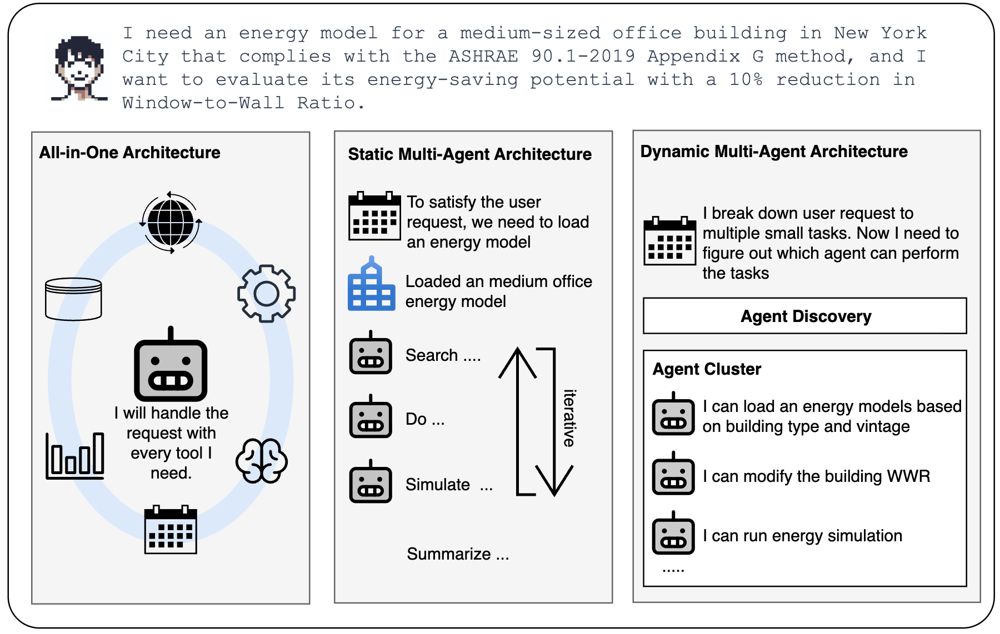
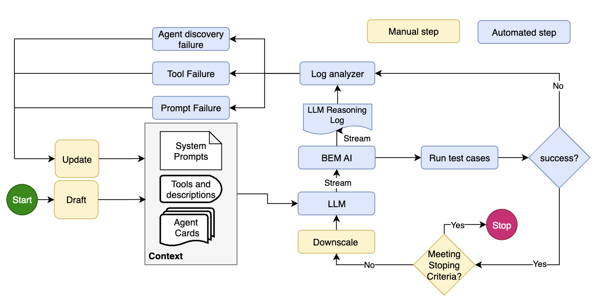
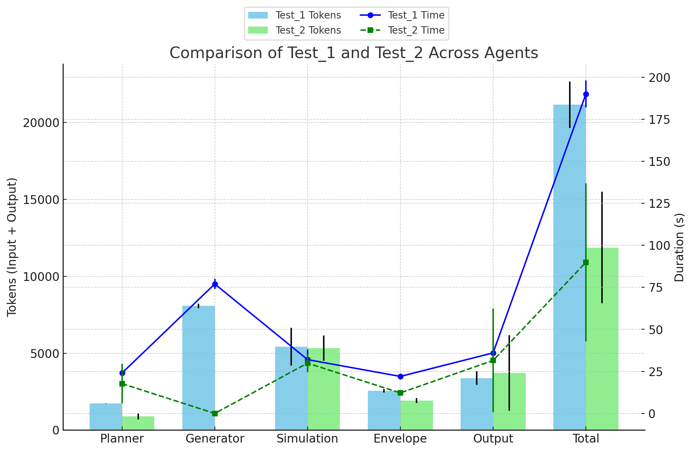

# 💬 BEM-AI (Autonomous OpenStudio Energy Modeling)
Development of a dynamic multi-agent network for building energy modeling: A case study towards scalable and autonomous energy modeling 

[link](https://papers.ssrn.com/sol3/papers.cfm?abstract_id=5447218)
## Problem Statement: Complexity and Opportunity in Building Energy Modeling (BEM)

- **BEM is powerful but complex** — traditional workflows require multi-disciplinary expertise, manual coordination, and significant time to produce accurate simulations.

- **AI is transforming technical workflows**, enabling automation, structured reasoning, and faster iteration in data-heavy engineering tasks.

- **Agentic AI offers a scalable solution** — specialized agents, coordinated by a central planner, can reason about objectives, run tools, and streamline end-to-end BEM processes.

---

### Frontiers of AI in Building Energy Modeling

Recent research has explored two major directions for integrating AI into BEM:

#### 1. Static Multi-Agent Systems  
Zhang et al. (2025) demonstrated a **static multi-agent framework** where specialized agents follow a fixed workflow to generate EnergyPlus models from text descriptions.  
#### 2. Fine-Tuned Domain Models  
Jiang et al. (2024) proposed **EPlus-LLM**, a fine-tuned large language model that directly translates natural language into EnergyPlus input files.  
#### 3. Usability and Accessibility Frameworks  
Elsayed et al. (2025) emphasized **usability** through a Grasshopper-based framework that translates natural language and images into structured model specifications.  

Despite the progress, significant challenges remain in **generalization, interpretability, and workflow integration**.  
There is a growing need for an AI-driven framework that is **both adaptive and practical** — capable of reasoning about modeling tasks while integrating directly with existing engineering workflows.

---

### Toward a Dynamic, Agentic Framework

#### What is Agent?
> “It started with perception AI… Then generative AI … Now we’re entering the era of ‘physical AI, AI that can perceive, reason, plan and act.”  
> — *Jensen Huang, NVIDIA GTC Keynote, 2025*

In recent years, the term **AI agent** has become central to how we think about the future of artificial intelligence.  
An *agent* can be thought of as an autonomous system — one that **perceives its environment, makes decisions, and takes actions** to achieve **specific goals**.  
Unlike a simple program, an agent can reason, adapt, and collaborate with other agents or tools.

Most of us have already used agents — often without realizing it.  
When you interact with **ChatGPT in a browser**, or **Claude through the desktop app**, you’re engaging with one form of agent.  
These are conversational or **chat-based agents**, designed to respond to human queries in natural language.

But AI agents can go further.
The next generation - Known as **tool agents** - can call APIs, run code, access databases, or control energy simulations to accomplish tasks autonomously.
They don't just *talk* about doing something - they actually *do* it.

---

### Agentic Architectures
The development of agentic AI has progressed through **three major architectural** paradigms, each reflecting a different balance between autonomy, control, and scalability.



#### 1. All-in-One (Single Agent) Architecture
This is the simplest form, where a single, powerful model performs all reasoning and execution tasks.
Examples include **Suna**, **Search-R1**, and commercial systems such as **OpenAI Deep Research** and **Perplexity Deep Research**.
This design reduces orchestration overhead and simplifies management but depends heavily on the reasoning capacity of one foundation model, limiting flexibility for complex or evolving tasks.

#### 2. Static Multi-Agent Architecture
To overcome these limits, the static multi-agent approach distributes responsibilities across multiple specialized agents arranged in predefined workflows.
Frameworks such as **AWS Step Functions** and **Google Cloud Workflows** exemplify this paradigm.
Systems like **CoSearchAgent**, **AI Scientist**, and **Agent Laboratory** demonstrate strong predictability and transparency — yet they remain rigid, requiring manual definitions and struggling to adapt to changing goals or unexpected dependencies.

#### 3. Dynamic Multi-Agent Architecture
Dynamic systems represent the newest frontier.
Here, agents are **modular and reconfigurable**, capable of forming or dissolving connections at runtime.
Frameworks such as **LangGraph Multi-Agent Swarm**, **OpenManus AI**, **OWL**, and **DRAMA** enable this flexibility through runtime orchestration, agent discovery, and evolving graph structures.
Such architectures allow workflows to emerge dynamically based on user intent, making them well-suited to domains like **Building Energy Modeling (BEM)** — where both modeling tools and analytical goals are continuously evolving.

---
### Why Dynamic Matters

Why Dynamic Multi-Agent Systems?

- **Future-proof and adaptable** — dynamic agents rely on high-level task logic rather than fixed workflows, allowing seamless upgrades or replacements as LLMs and frameworks evolve.

- **Modular and resilient** — changes remain isolated to individual agents, avoiding the brittleness of static pipelines or monolithic models.

- **Require strong coordination** — frameworks like BEM-AI, powered by A2A and MCP protocols, provide the communication and orchestration infrastructure needed for secure, reliable multi-agent collaboration.

---
### BEM-AI
Now, imagine applying that same paradigm to **building energy modeling (BEM)** — a process that typically requires coordination among multiple domain experts, software tools, and large datasets.  
This is where our work begins.

To bridge this gap, we introduce **BEM-AI** — a **dynamic multi-agent framework** for autonomous building energy modeling.


BEM-AI decomposes modeling tasks into smaller, specialized agents coordinated by a **central planner**.  
Unlike static multi-agent systems, workflows **emerge dynamically** based on user intent and system context.  
Each agent can invoke **programmatic tools, predefined functions, or automation scripts**, ensuring reliable execution while minimizing token and energy costs.

By supporting **smaller, domain-focused language models**, BEM-AI improves efficiency, scalability, and interpretability.  
Most importantly, it connects directly to tools like **OpenStudio** and **EnergyPlus**, making AI integration feasible in real-world engineering practice.

The following sections describe the **BEM-AI architecture**, the **proof of concept design**, and case studies that demonstrate how this system performs key modeling tasks autonomously.

1. **Agents** — an async A2A servers (supports JSON-RPC)
   1. Envelope agent
   2. Lighting agent
   3. Output analysis agent
   4. Planner agent
   5. Simulation agent
   6. Model template agent
   7. Orchestrator
2. **MCP Servers** - async MCP servers (supports JSON-RPC)
   1. OpenStudio MCP, including tools for energy model simulation and model manipulation.
   2. Model MCP, loads template openstudio models.
3. **Client** — a Streamlit-based chat UI built with React-style components and streaming support.

The client communicates with the server in real time, displaying streamed model responses as they arrive.

#### Foundational Framework
The AUTOMA-AI framework serves as the foundational infrastructure for BEM-AI, enabling distributed coordination among specialized AI agents for engineering applications. Developed at **Pacific Northwest National Laboratory (PNNL)**, **AUTOMA-AI** is a dynamic multi-agent network system built on Google’s **Agent-to-Agent (A2A)** and Anthropic’s **Model Context Protocol (MCP)** standards. It integrates **LangChain**, **LangGraph**, and **Google GenAI** to provide a flexible orchestration layer that allows agents to communicate, share memory, and coordinate tasks through standardized interfaces. The architecture centers on an **Orchestrator Agent** that manages workflow execution and agent discovery via an Agent Card Service, supported by **shared task memory**, **planning**, and **summarization agents**. Specialized agents interact through A2A for communication and MCP for tool and context access, enabling cross-model interoperability and modular agent composition.


In essence, AUTOMA-AI implements a dynamic multi-agent architecture that supports runtime adaptability and evolving graph structures—agents can be added, removed, or reconfigured without halting system execution. This allows it to serve as a backbone for complex, data-driven engineering workflows such as energy modeling, simulation, and compliance checking. The framework is open source and available on GitHub under **PNNL’s BEM-AI** repository
, and the design is further described in Xu et al. (2025) [SSRN 5447218](https://papers.ssrn.com/sol3/papers.cfm?abstract_id=5447218).

#### BEM-AI in action
To reproduce the BEM-AI experiment, users need to instantiate agents within the AUTOMA-AI framework using their own language models. Each agent is initialized through the AgentFactory class, which specifies its configuration, reasoning instructions, and underlying large language model (LLM). A minimal setup example for creating the planner agent is shown below:

```python
planner = AgentFactory(
    card=agent_card,
    instructions=PLANNER_COT,
    model_name="llama3.3:70b", # need to replace this model to a user accessible language model
    agent_type=GenericAgentType.LANGGRAPH,
    chat_model=GenericLLM.OLLAMA,
    response_format=ResponseFormat,
    model_base_url="http://..." # if needed, provide the base URL.
)
```
It is recommended to use a large-scale reasoning model (e.g., `llama3.3:70b`) for the planner agent, as it handles multi-step task decomposition and workflow orchestration. In contrast, lightweight or specialized reasoning models (e.g., `qwen3:4b`) are suitable for domain-specific agents such as energy modeling, material analysis, or compliance checking. This modular setup allows users to adapt the framework to available local or cloud-hosted models while maintaining interoperability across different agent types and backends.

See Live Demo of BEM-AI on [Youtube](https://youtu.be/eYhvig792Sc).

### Context Engineering
**Context engineering** is an emerging research and engineering discipline gaining traction alongside the rise of agentic AI. While often confused with prompt engineering, the two serve distinct but complementary roles.
**Prompt engineering** focuses on crafting the textual inputs provided to a LLM, guiding its reasoning, personality, and formatting. These prompts might include *instructions*, *role specifications*, and *step-by-step reasoning chain* designed to shape a single interaction or task response. **Context engineering**, on the other hand, addresses the broader environment in which agents operate. It involves fine-tuning the contextual information that surrounds and supports agents, ensuring that each component of an agentic AI system behaves coherently and interoperates effectively. 
This includes configuring **system-level instructions**, **tool interfaces**, **memory strategies**, and **inter-agent communication metadata**. In **BEM-AI**, we primarily optimized three types of context to improve agent performance and coordination.

#### A Semi-automated process to context engineering the multi-agent building energy modeling network. Yellow blocks indicate a manual step and blue blocks show automated steps


#### Table: Typical errors captured by log analyzer
| **Error Type**           | **Category**         | **Typical Observation**                                      | **Action**                                      |
|---------------------------|---------------------|--------------------------------------------------------------|------------------------------------------------|
| **Tool crash**            | Tool Failure        | AI: Tried to run the tool...                                 | Debug the tool                                 |
| **Missing tool**          | Tool Failure        | AI: I could use a tool ... to do ...                         | Develop a tool to meet the AI's ask            |
| **Wrong tool**            | Tool Failure        | AI: I will use the tool ... (incorrect)                      | Update tool's name and description             |
| **Wrong agent**           | Agent Card Failure  | Find agent for task ... (incorrect)                          | Update agent card context                      |
| **Over-reasoning**        | Agent               | AI: User does not provide but I think ...                    | Prompt refinement                              |
| **Wrong task order**      | Agent               | Task list is in an incorrect order                           | Prompt refinement                              |
| **Missing tasks**         | Agent               | There are missing task steps                                 | Upscale LLM or enhance specialty agent         |
| **Inefficient reasoning** | Agent               | LLM trapped in reasoning       

See optimized prompts in the [server script](./sim_bem_network_orchestrator.py).

### Evaluation
**Test 1 user request**: *I want to evaluate the energy savings from reducing window to wall ratio by 10% for a medium office building that is designed according to ASHRAE 90.1 2019 in Tampa Florida.*

**Test 2 user request**: *I have a model in local directory: /Users/xuwe123/ai/os-std-mod-mcp-server/resources/baseline.osm, Use this model to evaluate the energy savings from reducing window to wall ratio by 10%*

Repeated running the user request and analyze the token consumptions



---
# Action
## ⚙️ Prerequisites

Make sure you have the following installed:

- **Python 3.12+**
- **Streamlit**
- **automa_ai 0.2.0**
- **Async libraries** used in your BEM-AI (e.g. `httpx`, etc.)

To install dependencies:

```bash
pip install -r requirements.txt
```

Example `requirements.txt`:
```txt
streamlit
openstudio
automa_ai
```

or you can install the package directly with:
```bash
pip install automa_ai[sim_bem_network]
```

---

## Preparation
### Update local env file
Create a `.env` file in the root folder, using the [example.env](./example.env) as an example to specify language models, API keys, URLs and your local openstudio application path.

### Update sample models
Sample models such as [MediumOffice-90.1-2016-ASHRAE169-2013-2A.osm](./app_mcps/models/MediumOffice-90.1-2016-ASHRAE169-2013-2A.osm) has a path to weather file.
In the file, look for keyword **OS:WeatherFile** and update the weather URL to your local weather file directory.
Example below:

```bash
OS:WeatherFile,
  {2ff9bc59-5f2e-47e7-a90a-2054c165f27f}, !- Handle
  Tampa-MacDill AFB,                      !- City
  FL,                                     !- State Province Region
  USA,                                    !- Country
  TMY3,                                   !- Data Source
  747880,                                 !- WMO Number
  27.85,                                  !- Latitude {deg}
  -82.52,                                 !- Longitude {deg}
  -5,                                     !- Time Zone {hr}
  8,                                      !- Elevation {m}
  /Users/xuwe123/github/openstudio-standards/data/weather/USA_FL_Tampa-MacDill.AFB.747880_TMY3.epw, !- Url
  08A73550,                               !- Checksum
  ,                                       !- Start Date Actual Year
  Sunday;                                 !- Start Day of Week
```

## ▶️ How to Run

### Option 1: Run both (recommended)
Use the provided shell script to start both server and Streamlit client together:

```bash
chmod +x run_all.sh
./run_all.sh
```

This will:
- Start the BEM-AI server on `http://localhost:10100`
- Wait a few seconds
- Launch the Streamlit chat UI on `http://localhost:8501`

> Press **Ctrl+C** to stop both processes cleanly.

---

### Option 2: Run manually

#### 1️⃣ Start the server
```bash
python sim_bem_netowrk_orchestrator.py
```

Once you see:
```
✅ Agent servers started at http://localhost:10100/
```

#### 2️⃣ In a new terminal, start the client
```bash
streamlit run streamlit_ui.py
```

---

## 💻 Access the Chatbot

After starting, open your browser and go to:

👉 [http://localhost:8501](http://localhost:8501)

You should see the Streamlit-based chat interface.  
Type a message and watch the assistant stream its response in real time.

---

## 🧹 Stopping the App

Press **Ctrl+C** in the terminal where you ran `run_all.sh`.  
Both the server and Streamlit client will shut down gracefully.

---
